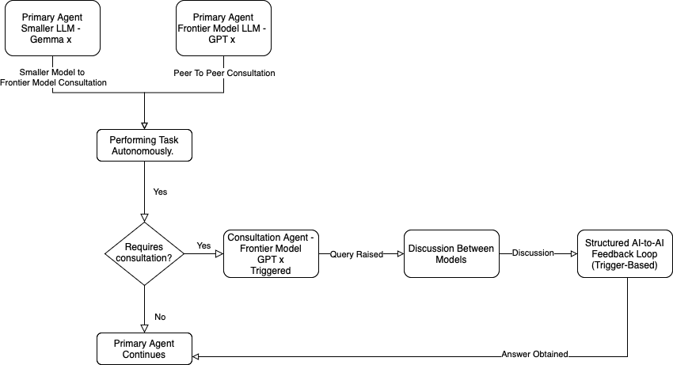

# AI-to-AI Feedback: Intelligence Amplification Through Inter-Model Communication

**First developed: May 10, 2025**
**By: Pantaleone Ruocco (Leo)**

A novel approach to enhancing AI capabilities through direct inter-model feedback loops, particularly for debugging and problem-solving tasks.

## Overview

AI-to-AI Feedback is a technique I've developed that goes beyond traditional multi-agent systems by enabling direct feedback loops between AI models to enhance their collective intelligence and problem-solving capabilities.

While multi-agent systems typically involve multiple AI agents working independently or in parallel on different aspects of a problem, this approach is fundamentally different: it creates a structured feedback mechanism where one AI model's output directly enhances another model's understanding and reasoning capabilities, resulting in intelligence amplification.

## Key Innovation

The core insight is that smaller, more efficient models (like a 4B parameter model) can achieve reasoning and problem-solving capabilities beyond their inherent limitations by incorporating structured feedback from larger frontier models. This creates an intelligence amplification effect where:

1. A smaller model attempts to solve a complex problem (e.g., debugging a code issue)
2. Its reasoning and solution are evaluated by a larger, more capable model
3. The feedback is structured and fed back to the smaller model
4. The smaller model incorporates this feedback to produce enhanced reasoning and solutions
5. This cycle continues, creating progressive improvement

This approach differs fundamentally from traditional multi-agent systems where agents might collaborate but don't directly enhance each other's intelligence through structured feedback loops.

## Vision: On-Demand Intelligence Amplification

My vision is that smaller parameter models (like 4B parameter models) can perform complex tasks far beyond their original capabilities through on-demand consultation with frontier models. Key aspects of this vision include:

- **Targeted Consultation**: The smaller model only consults the frontier model when it gets stuck on a specific challenge, not for every task
- **Cost Efficiency**: This dramatically reduces costs by only using expensive frontier models for specific challenging parts of a task
- **Contextual, Not Training**: This isn't about permanently training or fine-tuning the smaller model - it's about contextual, task-specific assistance
- **Resource Optimization**: The approach optimizes computational resources by using the right level of model for each part of a task

For example, a 4B parameter model might handle 90% of a complex coding task independently, only consulting a frontier model when it encounters a particularly challenging algorithm or architectural decision. After receiving guidance, the smaller model continues the task on its own.

This keeps costs down by only using expensive models when the smaller model needs support. The AI-to-AI context is not persistent - it's just for that quick task, for that one purpose. It's not training, but rather a form of contextual intelligence amplification.

## Applications in Debugging

The initial application focuses on debugging complex code issues, where:

- The primary debugging agent might have limited context or specialized knowledge
- Feedback from a more capable model helps identify reasoning errors or knowledge gaps
- The primary agent incorporates this feedback to improve its debugging approach
- The process continues until a solution is reached

This creates debugging capabilities that exceed what either model could achieve independently.

## Technical Implementation

The system uses:

- JSON-based conversation storage for maintaining context across models
- API bridges between different AI systems (e.g., connecting Augment Code with models on OpenRouter)
- Contextual linking to maintain relationships between concepts
- Selective context pruning to manage context window limitations
- Optional vector database integration for extended debugging sessions

## Current Status

This repository currently contains the conceptual framework and methodology for AI-to-AI Feedback. Implementation code will be added soon as the approach is further refined and documented.

## Getting Started

Detailed implementation guides and example code will be provided in upcoming updates. If you're interested in contributing or discussing this approach, please open an issue or reach out directly.

## 🔁 AI-to-AI Feedback Flow

This system enables any LLM—large or small—to initiate structured peer consultation when uncertain, instead of hallucinating or stalling. It supports both small-to-frontier and frontier-to-frontier interactions.


## 📄 Whitepaper

For a full explanation of the framework, theory, and implementation approach:

➡️ [Read the full whitepaper](whitepaper.md)  
📥 [Download as PDF](docs/whitepaper.pdf)


## Contact & Additional Resources

- Twitter/X: [@leo_ai75](https://x.com/leo_ai75)
- LinkedIn: [Original Article on AI-to-AI Feedback](https://www.linkedin.com/posts/lruocco_aitoaifeedback-intelligenceamplification-activity-7326922466470076416-hKVU?utm_source=share&utm_medium=member_desktop&rcm=ACoAAALn16sBlHw2oANUlK1Kul1P76OQPcs7eog)/
## Citation

If you use this concept in your work, please cite:

```
Ruocco, P. (2025). AI-to-AI Feedback: Intelligence Amplification Through Inter-Model Communication. GitHub Repository. https://github.com/tech-and-ai/ai-to-ai-feedback-amplify-intelligence
```

## License

MIT License

---

*Note: This README establishes the conceptual framework for AI-to-AI Feedback and Intelligence Amplification as developed in May 2025. Code implementation will be added to this repository soon.*
